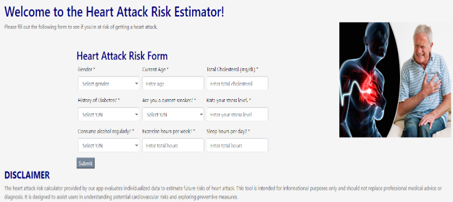
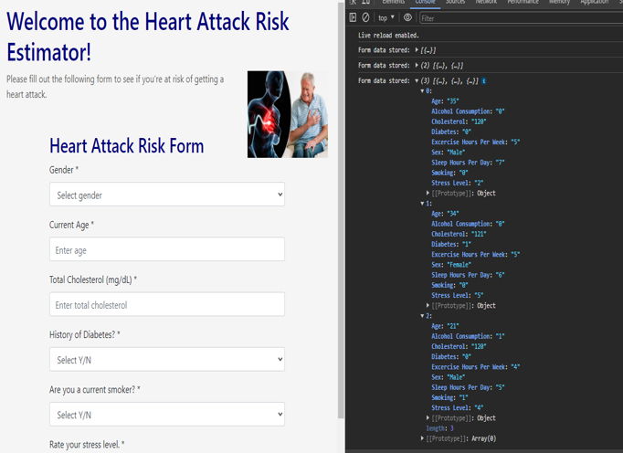

# project_4

# Heart Attack Risk Assessment App
Welcome to our Heart Attack Risk Assessment App! Our goal is to empower users to understand their potential risk of heart attack through a user-friendly platform. Here's a brief overview:

## Features:
* **Customizable Risk Form:** Our app includes a comprehensive form covering various factors such as gender, age, cholesterol levels, diabetes history, smoking habits, stress levels, alcohol consumption, exercise, and sleep patterns.

  

* **Transparency and Accountability:** We value transparency and have included a disclaimer emphasizing that our tool serves as an informative guide and should not replace professional medical advice.

* **Data Processing:** Upon form submission, JavaScript functions handle data processing. Information is securely captured and stored in an array for diagnostic purposes.

  

  

* **Machine Learning Prediction:** Data undergoes analysis through our machine learning model, enabling us to predict potential heart attack risks with enhanced precision.

## Disclaimer:
Please note that while our app provides valuable insights, it is not a substitute for professional medical advice. We strongly encourage users to consult healthcare professionals for personalized guidance and to prioritize proactive measures for cardiovascular health.

## Next Steps:
Now, let's delve into how our model makes these predictions.